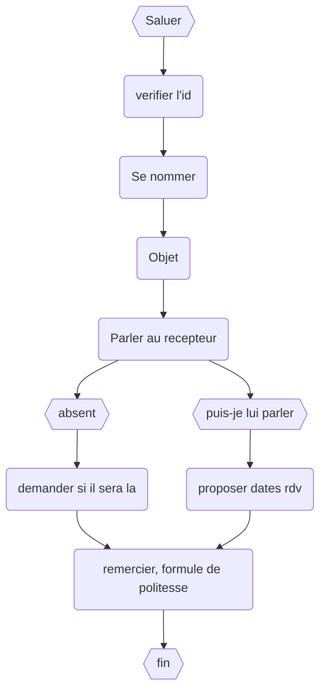

# Relance téléphonique

Cela sert a montrer qu'on est motivé le but est d'obtenir un rdv et dicuter en direct avec un entrepreneur

On ne dis jamais "est ce que vous pouvez me le passer", "ne quittez pas" mais plutot "je reste en ligne"

