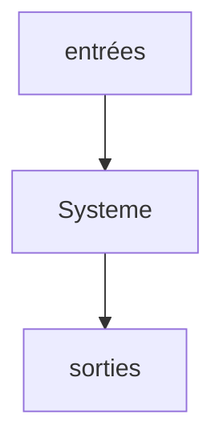

# Management des SI

## Définitions

- **Données** = qqch de brut sans contexte (different d'une information)

- **CRM** = Customer Relation Management

- **organisation** = structure suivant une logique propre pour atteindre un but précis

- **Systeme d'information** = Ensemble d'elements (matériel, perso, logiciel, processus) permettant d'acquerir, classifier, traiter, mémoriser et communiquer des informations . Le SI doit etre organisé, construit, finialisé, maintenu, animé et controlé. Il constitue des moyens d'optimisations de la performance de l'orgaisation et lui permet d'atteindre ses objectifs

- **ERP** = **PGI** = Progitiel de gestion Interne

- **SAAS** = Service As A Software

## Le organisation

Les 3 systemes de base d'une organisation : 

1. systeme opérant

2. systeme d'information 

3. systeme de pilotage

### 1. Systeme opérant

Aussi qualifié de systeme technologique ou physique ou de production, il est a la base de toute organisation. Niveau de la production, de opérations, de chaques services, chaques unitées ou chaque sous organisations

### 2. Systeme de pilotage

Aussi dénomé systeme de management ou de décisions. A la tête de toute organisationscar c'est lui qui pilote le systeme opérant. Il fixe les objectifs et prend les décisions

### 3. Systeme d'informations

Il intervient entre les deux, il apporte les informations opérationnelles nécésairres aux activitées et les informations. Il apporte les informations opérationnelles aux activitées ets les informations indispensables à la gestion: l'information apparait ainsi comme la base de la décision. C'est pourquoi on désigne souvent le SI comme le systeme d'information pour le management ou parfois le systeme D'information pour la gestion

### 4. Interactions entre les systeme

On distingue dabbord le systeme opérant ou les produits finaux sont fabriqués à partir d'une contrainte matiere premiere. On réduit l'organisation a une sorte d'usine qui travaille sur la matiere premier pour fournir un produit final

Toute organisation est pilotée par une direction, elle a poiur mission de conduire l'organisation vers des objectifs. Cela nécessite souvent des décisions, un controle continu du fonctionnement du systeme opérant.
