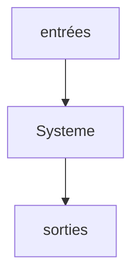
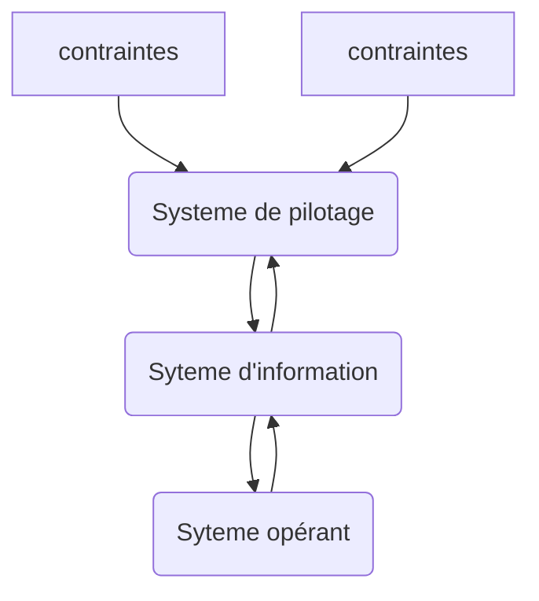
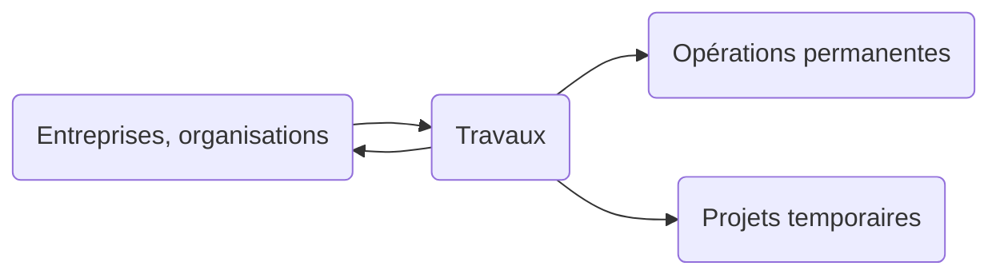
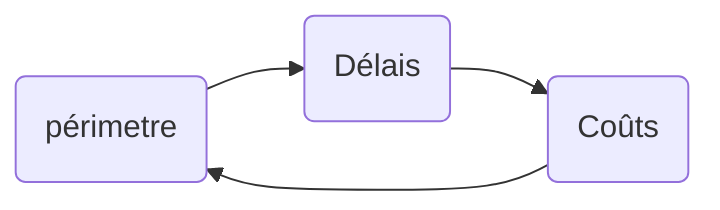
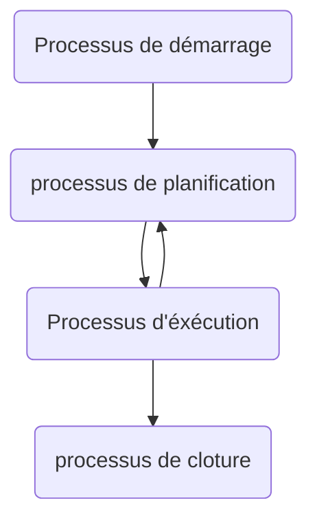
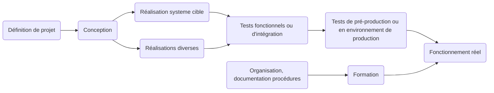
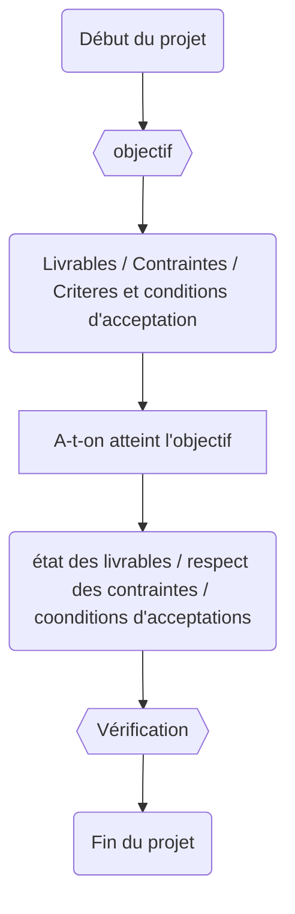

# Management des SI

## Définitions

- **Données** = quelque chose de brut sans contexte (different d'une information)

- **CRM** = Customer Relation Management

- **organisation** = structure suivant une logique propre pour atteindre un but précis

- **Systeme d'information** = Ensemble d'elements (matériel, perso, logiciel, processus) permettant d'acquerir, classifier, traiter, mémoriser et communiquer des informations . Le SI doit etre organisé, construit, finialisé, maintenu, animé et controlé. Il constitue des moyens d'optimisations de la performance de l'orgaisation et lui permet d'atteindre ses objectifs

- **ERP** = **PGI** = Progitiel de gestion Integré

- **SAAS** = Software As A Service (le prestaire fait tout)

- **PAAS** = Plateforme As A Service (serveur vierge)

- **IAAS** = Infrastructure As A Service (plateforme + infrastructure)

## Le organisation

Les 3 systemes de base d'une organisation :

1. systeme opérant

2. systeme d'information

3. systeme de pilotage

### 1. Systeme opérant

Aussi qualifié de systeme technologique ou physique ou de production, il est a la base de toute organisation. Niveau de la production, de opérations, de chaques services, chaques unitées ou chaque sous organisations

### 2. Systeme de pilotage

Aussi dénomé systeme de management ou de décisions. A la tête de toute organisationscar c'est lui qui pilote le systeme opérant. Il fixe les objectifs et prend les décisions

### 3. Systeme d'informations

Il intervient entre les deux, il apporte les informations opérationnelles nécésairres aux activitées et les informations. Il apporte les informations opérationnelles aux activitées ets les informations indispensables à la gestion: l'information apparait ainsi comme la base de la décision. C'est pourquoi on désigne souvent le SI comme le systeme d'information pour le management ou parfois le systeme D'information pour la gestion

### 4. Interactions entre les systeme

On distingue dabbord le systeme opérant ou les produits finaux sont fabriqués à partir d'une contrainte matiere premiere. On réduit l'organisation a une sorte d'usine qui travaille sur la matiere premier pour fournir un produit final

Toute organisation est pilotée par une direction, elle a poiur mission de conduire l'organisation vers des objectifs. Cela nécessite souvent des décisions, un controle continu du fonctionnement du systeme opérant. Et D'eventuelles modifications a aporter. 

Parallèlement aux flux physique, il y a un flux de décision; Ce flux correspond aux décisions prises par la direction de l'organisation pour que celle-ci fonctionne dans les meilleures conditions et puisse atteindre ses objectifs. Enfin, toute organisation est soumise à des contraintes ectérieures et intérieures qui conraingnent son action et l'empeche dévoluer librement

Pour le systeme opérant:

- informations délivrée souvent basique et unitaire. Chaque individu a besoin de connaitre le flux physique qui la traverse(exemple la commande en cours de traitement, le stock du produit X)

- Informations souvent tournée vers le présent, très détaillé et ne concerne qu'un petit élément de l'organisation.

Pour le systeme de pilotage:

- informations sintétiques et agrégées(exemple chiffre d'affaire de l'année, d'un secteur, d'un ...)

- information concerner une grande partie de l'organisation(exemple valeur du stock actuel)

- informations souvent tournée vers le passé ou vers le futur(exemple comparaison des chiffres d'affaires des années, prévisions, ...)

## Gestion de projet

### Le concept de gestion de projet

Les 3 points qui caractérisent un projet

- Le projet est temporaire( début, fin, délai)

- il se réalise en étapese

- On a un objectif, le(s) livrable(s) (permet de mesurer le succs du projet)

Un projet est un processus unique qui consiste en un ensemble d'activités coordonnées et maitrisés comportant des dates de début et de fin, entrepris dans le but d'atteindre un objectif conforme a des exigences spécifiques telles que des contraintes de délais, de coûts et de ressources.

- repecter les délais

- Maitriser les coûts

- Respecter la qualité/le périmetre

Processus de surveillance et de maitrise : 

Exemple de processus de projet informatique

### Énonce du projet

Définition du projet, de ce qui doit être accompli.

- Document référence d’engagement de résultat.

- Puis, éventuellement, cahier des charges, appel d’offre, et contrat.

Comprend les éléments suivants :

- Objectifs du projet et du produit issu du projet.

- Description du produit issu du projet (exigences et caractéristiques, description des produits ou services que le projet doit fournir)

- Limites et hypothèses du projet, les exclusions du projet.

- Critères d’acceptation du produit.

- Livrables du projet.

- Contraintes du projet :
  
  - Coûts
  
  - Délais
  
  - Indicateurs de qualité
  
  - Normes

### Processus de vérification

### Processus d'obtention de l'écheancier

1) Rescecement des livrables (PBS)

2) Identification des taches(ou activitées WBS)

3) Estimation des durées des taches

4) EStimation des ressources et du cout (RBS - CBS)

5) Ordonnancement (PERT - MPM)

6) Echeancier du projet (GANTT)

### Livrables

1. Livrables demandés par le commanditaire ou maitre d'ouvrage

2. Livrables exigés par nos méthode de travail

3. Livrables nécessaires au processus de production

### PBS - Product Breakdown Structure ou organigramme des livrables

Le PBS est une décomposition du projet par livrable. Cette structure aboutit au lot de travaux. A chaque éléments est attribué un responsable, avec les taches et les objectifs correspondants. le PBS permet donc le découpage du projet.

### WBS - Work Breakdown Structure ou liste des taches a acomplir

Il sagit d'identifier toutes les taches nécessaires à la réalisation du produit et a la conduite du projet. Il est construit a partir du PBS, il faut identifier toutes les taches de chaqeu livrables. Le WBS est le travail a accomplir pour réaliser votre planning de Gantt qui serat un outil essentiel dans votrz suivi des taches.

### RBS - Ressources Breakdown Structure

liste des ressources qui vont intervenir sur le projet. Ressources "classiques", autres intervenant    

# 
